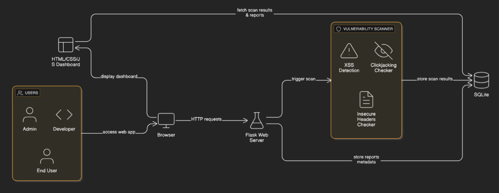
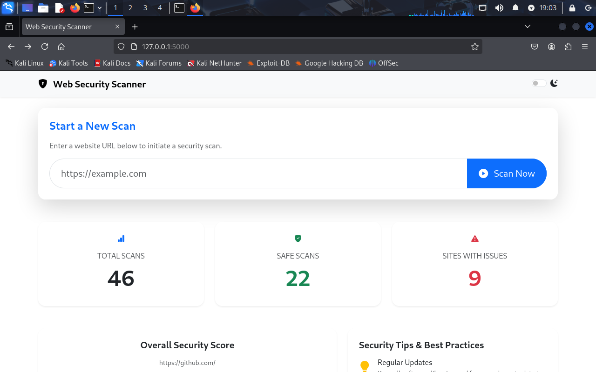
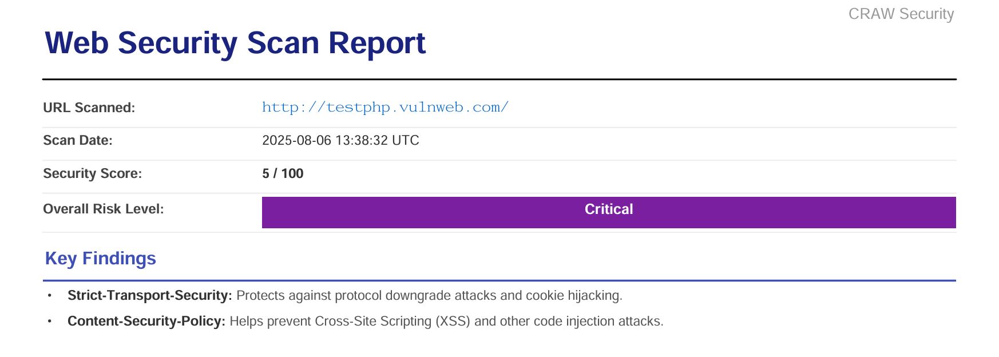
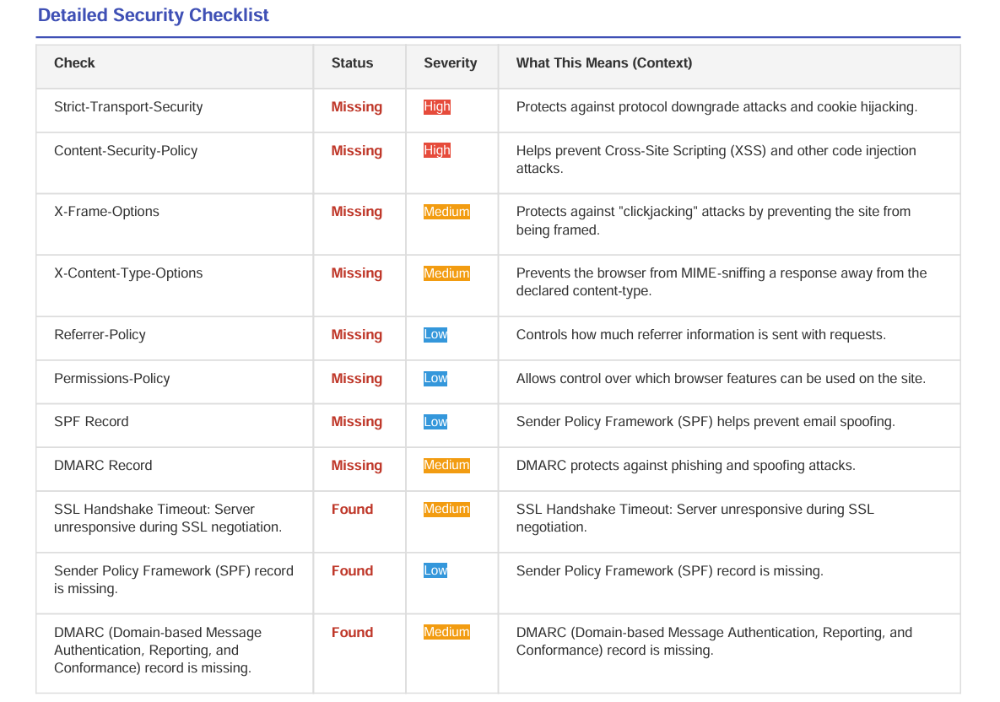
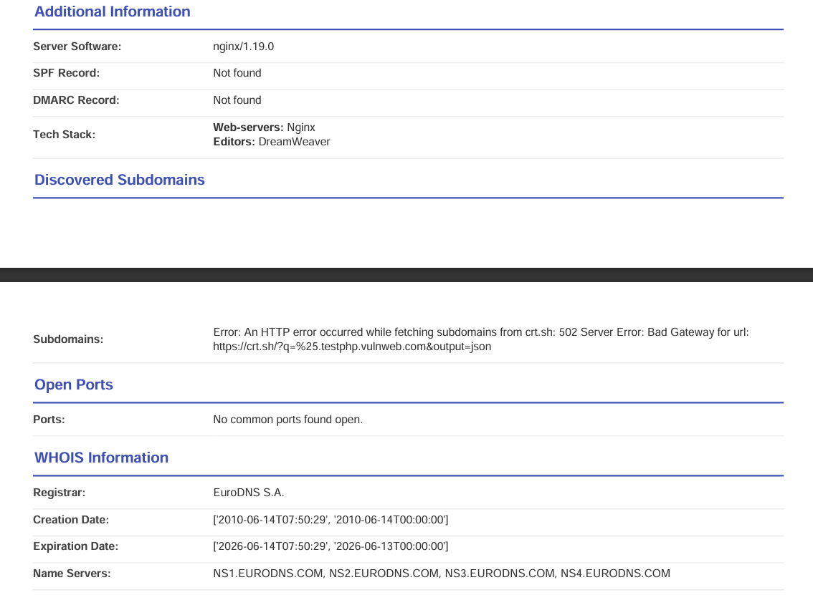
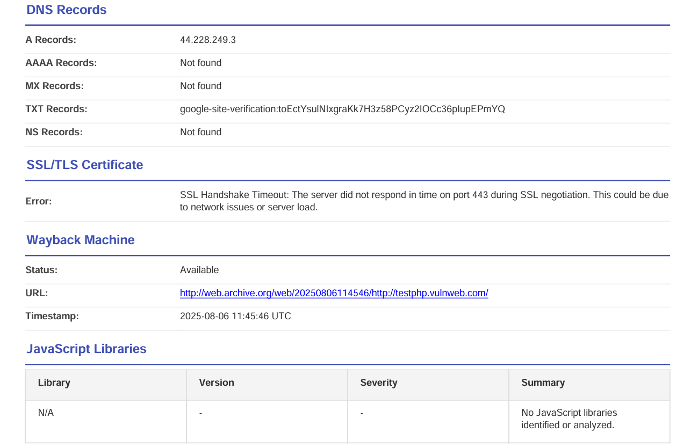
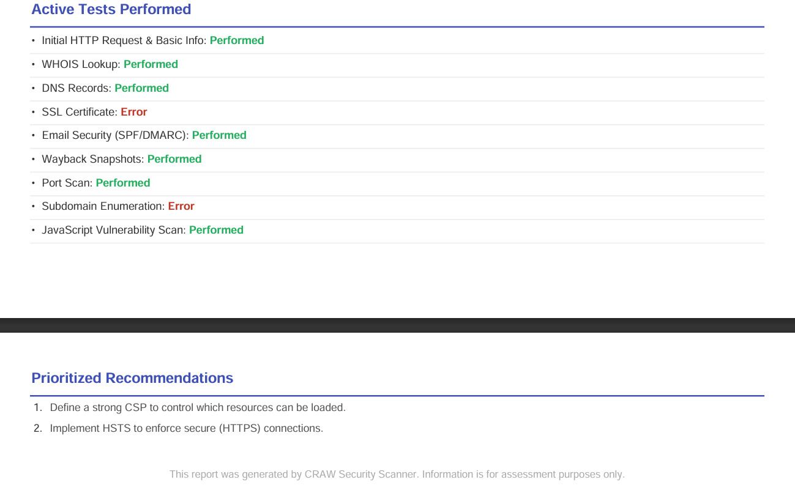

# 🛡️ Web Security Scanner

> **Live Now at:** [hackersgonnahack.pythonanywhere.com](https://hackersgonnahack.pythonanywhere.com)  
> Scan your websites for vulnerabilities in real-time with automated intelligence and sleek reporting dashboards.

A powerful, full-stack web application designed to perform **comprehensive security assessments** of websites. Analyze, detect, and track vulnerabilities with beautiful interactive reports and dashboards.

---

## ✨ Overview

**Web Security Scanner** is an automated vulnerability analysis tool focused on **web reconnaissance** and **active testing**. It helps developers and security enthusiasts understand the **security posture** of web applications by generating transparent and actionable reports.

> ✅ Ideal for bug bounty hunting, web developers, and cybersecurity learners.

---

## 🏗️ Architecture Diagram



---

## 📸 Live Preview

### 🔹 **🌐 Live Dashboard Example**  -->  *View scan statistics, charts, and history.*



### 🔹 **Detailed Report View**  -->  *See vulnerability details and past scan comparisons.*

 





---

## 🚀 Key Features

### 🔍 **Automated Reconnaissance**

  * WHOIS, DNS (A, MX, TXT, etc.)
  * SSL Certificate Details
  * Subdomain Discovery (`crt.sh`)
  * HTTP Headers & Cookies
  * Technology Stack Detection

### 🛠️ **Vulnerability Testing**

  * SQL Injection
  * Cross-Site Scripting (XSS)
  * Open Redirect
  * Directory Traversal

### 📦 **Vulnerable JS Library Detection**

  * Scans for outdated or insecure frontend libraries.

### 📊 **Interactive Dashboard**

  * Security scores
  * Time-based scan trends
  * Filterable scan history

### 🧾 **Comprehensive Reporting**

  * HTML-based report view
  * Active modules & results log
  * Real-time scan status

### 📂 **Export Options**

  * Download reports in **PDF**, **CSV**, and **JSON** formats.

### 🔁 **Historical Tracking**

  * Compare current and past scan results
  * Highlights newly discovered or resolved issues

### 🧱 **Error-Resilient Architecture**

  * Fallback mechanisms for Nmap/socket scanning
  * Graceful handling of timeouts or network errors

---

## 🧰 Tech Stack

| Layer         | Tools & Libraries                                                             |
| ------------- | ----------------------------------------------------------------------------- |
| **Frontend**  | HTML, CSS, Bootstrap, Jinja2, JavaScript, Chart.js, date-fns                  |
| **Backend**   | Python, Flask, Flask-SQLAlchemy, Multiprocessing                              |
| **Database**  | SQLite via SQLAlchemy ORM                                                     |
| **Scanning**  | `requests`, `python-whois`, `python-nmap`, `dnspython`, `builtwith`, `crt.sh` |
| **Reporting** | `xhtml2pdf`, `pypdf`, `pyhanko`, `reportlab`, `csv`, `json`                   |

---

## ⚙️ Getting Started

### 🔑 Prerequisites

Make sure the following are installed:

* Python 3.x
* Git
* (Optional) Nmap for advanced port scanning

---

## 📦 Installation
### 1️⃣ Clone the repository

```
git clone https://github.com/prajwalchapke055/Web-Security-Scanner.git
cd Web-Security-Scanner
```

### 2️⃣ Fix permissions (if needed on Linux/Kali)
```
sudo chown -R $USER:$USER ~/security-project/Web-Security-Scanner
```

### 3️⃣ Create and activate a virtual environment
```
# Create virtual environment
python3 -m venv venv

# Activate virtual environment
# On Windows:
.\venv\Scripts\activate
# On Linux/macOS:
source venv/bin/activate
```

### 4️⃣ Upgrade pip and install dependencies
```
pip install --upgrade pip
pip install -r requirements.txt
```

### ▶️ Running the Application

```
python app.py
```

Open in your browser:
http://127.0.0.1:5000

---

## 🧪 How to Use

1. Launch the app and enter a website URL (e.g., `https://example.com`).
2. Click **"Scan Now"**.
3. Wait for the scan to complete (Dashboard will update).
4. Click **"View Report"** for detailed findings.
5. Use export buttons to download reports as **PDF**, **CSV**, or **JSON**.

---

## 🌐 Deployment

Want to make your scanner public?

* Deploy on **PythonAnywhere** *(great free tier for testing)*.
* Switch database to **PostgreSQL/MySQL** for production use.
* Use **Gunicorn** or **Waitress** for WSGI deployment.

---

## 📄 License

This project is licensed under the [MIT License](./LICENSE).

---

# ⭐ Found this useful? Star the repo and share it!
